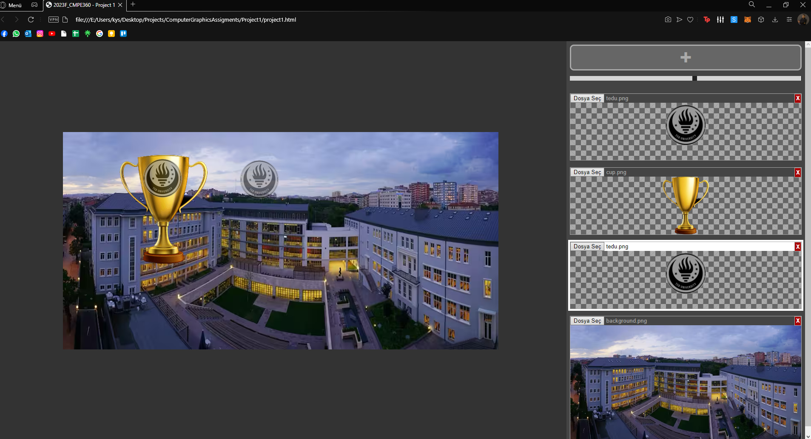
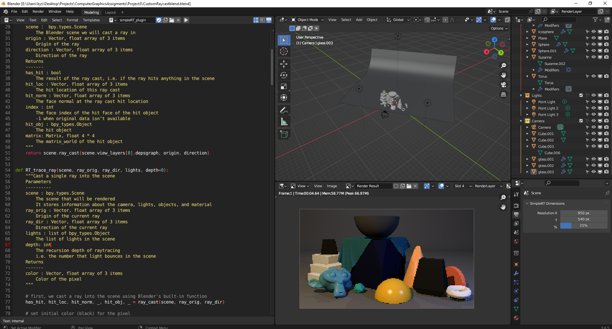

# ComputerGraphicsAssigments
My Computer Graphics projects that I created in  CMP360  2023 Fall and by myself. This course was my favorite in my Computer Engineering degree.

# Table of contents
- [Alpha Compositing](#alpha-compositing)
- [Transformation](#transformation)
- [Custom Ray Tracer](#custom-ray-tracer)
 
## Alpha Compositing 
 
Within this project, we aim to create an alpha compositing function for raster images using JavaScript and HTML.
Learned the Raster Graphics fundamentals.

- Add images from the + icon.
- Change opacity with the slider.
- Change the image position with the mouse.

## Transformation
 
Within this project, we aim to apply a transformation to an object using JavaScript and HTML. HTML features a basic simulation of Drone.
Function GetTransformation crates the transformation matrix and ApplyTransform applies the transformation.
Learned the Transformations fundamentals.

- W-S Zoom In/Out.
- A-D Rotate Drone.
- Q-E Increase/ decrease speed.

## Custom Ray Tracer
 
Within this project, we aim to create a ray tracer using Python in Blender. We will use scripts to get information
from the scene through Blender's Python API, and create our own routine for bouncing lights in the scene to get rendered images. 
Learned the Ray Tracing and Rendering Fundamentals. 

*This project contains*:
- Shadow-ray.
- Bling-Phong Effect.
- Ambient Light Effect. 

*To run and edit project*:
-  Run simpleRT_UIpanels.py
-  Run the simpleRT_UIpanels.py
-  Switch Render Engine to SimpleRT (In render properties).
-  Reload Scripts by pressing F3 and find reload Scripts.
